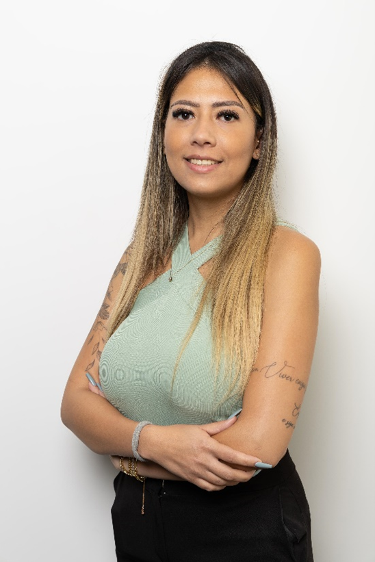
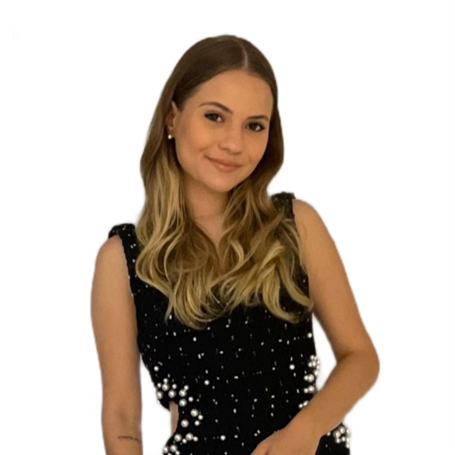
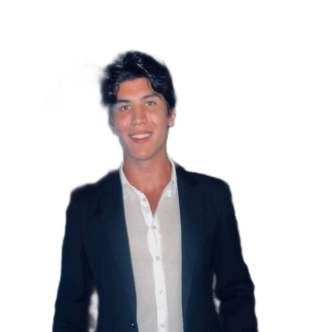
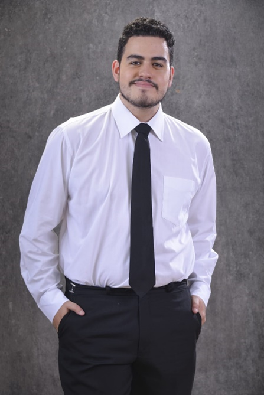
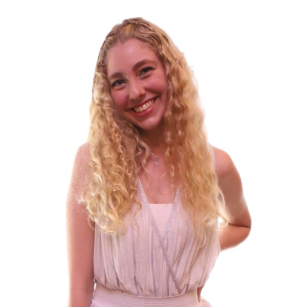
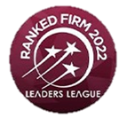
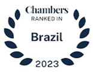
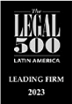

# Escritório RSMDG Advogados Associados
<h2 style="font-size: 1.5em; color: gray;">15 Anos de Confiança e Excelência na Análise de Ativos Judiciais!</h2>

Com 15 anos de história e uma reputação sólida, o RSMDG Advogados Associados é mais do que um escritório de advocacia; é um parceiro estratégico para aqueles que buscam segurança e clareza na análise de ativos judiciais.

## Quem Somos
### Sobre o Escritório

Fundado em 2008, o escritório RSMDG Advogados Associados se consolidou como uma referência nacional na área de due diligence voltada para a análise de ativos judiciais. Com sede em São Paulo, a equipe do RSMDG é composta por advogados e especialistas em direito que oferecem uma abordagem minuciosa e personalizada, visando garantir a segurança e a transparência nas operações de seus clientes.    
Ao longo de seus 15 anos de atuação, o RSMDG se destacou pela capacidade de unir conhecimento técnico e uma profunda compreensão do cenário jurídico brasileiro. Sua equipe é reconhecida por realizar análises detalhadas de ativos, avaliando não apenas a situação legal dos bens, mas também os riscos associados e as oportunidades de recuperação. Essa expertise é fundamental para empresas, investidores e instituições financeiras que buscam realizar transações seguras e informadas.    
O compromisso do RSMDG com a confiança e a ética é palpável em cada projeto. Desde sua fundação, o escritório se dedicou a estabelecer relações duradouras com seus clientes, pautadas pela transparência e pelo respeito mútuo. Através de um processo rigoroso de auditoria jurídica, a equipe fornece relatórios abrangentes que capacitam seus clientes a tomar decisões estratégicas, mitigando riscos e maximizando oportunidades.    
A inovação é uma das chaves para o sucesso do RSMDG. O escritório investe continuamente em tecnologia e ferramentas de análise, garantindo que seus serviços estejam sempre na vanguarda do setor. Isso inclui a implementação de sistemas de inteligência artificial para a triagem de informações e a análise preditiva de riscos, tornando o processo de due diligence ainda mais eficiente e assertivo.
Além disso, o RSMDG se destaca pelo compromisso com a formação contínua de seus profissionais. A equipe participa regularmente de cursos e seminários, mantendo-se atualizada sobre as mudanças na legislação e nas melhores práticas do mercado. Esse investimento no capital humano reflete diretamente na qualidade do serviço prestado, garantindo que cada análise de ativos judiciais seja feita com a mais alta competência.
A reputação do RSMDG é consolidada por uma série de cases de sucesso, onde a atuação diligente do escritório resultou na recuperação de ativos significativos e na proteção dos interesses de seus clientes. As referências positivas recebidas de empresas e organizações de diversos setores atestam a confiabilidade e a excelência do trabalho realizado.    
Nos próximos anos, o RSMDG continuará a expandir seus horizontes, mantendo-se fiel aos princípios que o tornaram um nome respeitado no mercado. A busca pela excelência e a dedicação à confiança e à ética continuarão a guiar o escritório em sua trajetória de sucesso.
Com 15 anos de história e uma reputação sólida, o RSMDG Advogados Associados é mais do que um escritório de advocacia; é um parceiro estratégico para aqueles que buscam segurança e clareza na análise de ativos judiciais.    

### Conheça os Sócios

    <!-- Row 1 -->
    <figure style="width: 150px; text-align: center;">
        
        <figcaption>Isabella Rodrigues   Sócio</figcaption>
    </figure>
    <figure style="width: 150px; text-align: center;">
        
        <figcaption>Laura Sacchetto   Sócio</figcaption>
    </figure>
    <figure style="width: 150px; text-align: center;">
        
        <figcaption>Omar Medeiros   Sócio</figcaption>
    </figure>

    <!-- Row 2 -->
    <figure style="width: 150px; text-align: center;">
        
        <figcaption>Pedro Doudement   Sócio</figcaption>
    </figure>
    <figure style="width: 150px; text-align: center;">
        
        <figcaption>Sophia Ganeff   Sócio</figcaption>
    </figure>

### Nossa Equipe

    
ASSISTENTES JURÍDICOS

    <ul>
        <li>Ana Clara Silva</li>
        <li>Mariana Gomes Costa</li>
        <li>Lucas Fernando Santos</li>
    </ul>

    
ADVOGADOS

    <ul>
        <li> Dra.  Beatriz Rodrigues Lima </li>
        <li> Dra. Juliana Martins Ferreira </li>
        <li> Dr. Rafael Almeida Pereira </li>
        <li> Dr.  Felipe dos Santos Rocha </li>
        <li> Dra. Letícia Vieira da Cruz </li>
        <li> Dr. Gustavo Henrique Almeida </li>
        <li> Dr. João Pedro Oliveira </li>
        <li> Dra. Barbara Guimarães  </li>
        <li> Dra. Giovana Almeida  </li>
        <li> Dr. Mauricio Ferro  </li>
        <li> Dra. Raquel Marques </li>
    </ul>

    
ESTAGIÁRIOS

    <ul>
        <li> Camila Soares de Lima</li>
        <li> Thiago Carvalho Mendes</li>
        <li> Larissa Martins da Silva</li>
        <li> Pedro Bonadia </li>
        <li> Simone Fernandes </li>
    </ul>

    
ADMINISTRATIVO

    <ul>
        <li> Leonardo Souza Martins </li>
        <li> Gabriela Dias de Oliveira </li>
        <li> Samuel Henrique Santos </li>

    </ul>

## Nossas Premiações

    <!-- Row 1 -->
    <figure style="width: 100px; text-align: center;">
        
    </figure>
    <figure style="width: 110px; text-align: center;">
        
    </figure>
    <figure style="width: 150px; text-align: center;">
        
    </figure>
    <figure style="width: 180px; text-align: center;">
        
    </figure>
    <figure style="width: 100px; text-align: center;">
        
    </figure>

